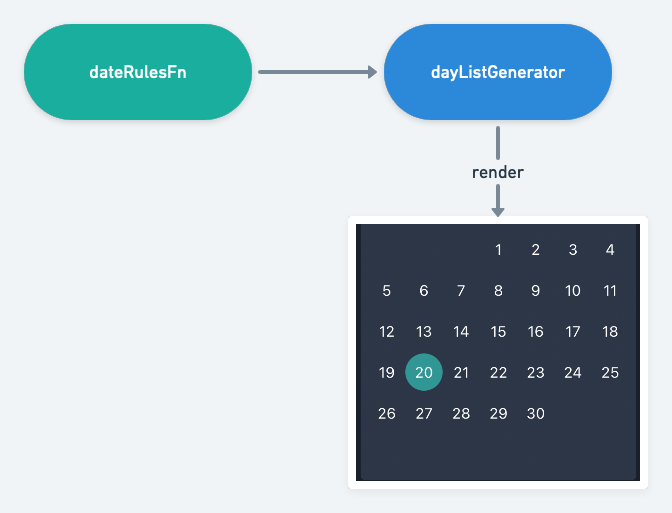

## chakra DatePicker
[Demo (PC only)](https://chakra-datepicker.netlify.app/)

### 專案目的
有時我們常使用現成的 DatePicker 組件來實現需求，但總會遇到很多限制，例如**樣式不好改**、**功能被限制**、**整體風格跟畫面不符**，因為上述原因我決定自己嘗試設計了 DatePicker 組件，在專案中有不錯的成效，包含功能的彈性跟樣式的修改。

當然有優點也會伴隨一些缺點，但我認為這些是工程師們需要做取捨的，因為沒有絕對的好或不好，只有適不適合，我也會以我自己的觀點分析好壞。

要注意的是，本作品目的不在於**提供**一個 DatePicker 組件，而是提供給各位設計 DatePicker 的想法跟思路，以便你在各種專案做變化。

### 1. 組件拆解（以選擇單天為例）
設計複雜組件前通常會將組件拆解成各個小部分，於是我把 DatePicker 分成以下三部分
```js
<ControlBar />
<Week />
<Calendar />
```
#### ControlBar
這個組件主要是用來做年月切換操作的 component ，由於本身並不複雜，頂多會有一些樣式調整，所以不多做說明。

#### Week
單獨顯示一個星期文字的 component ，因為星期永遠不變，所以也只會有樣式的修改。

#### Calendar
Calendar 是整個 DatePicker 的核心，他的功能包含了顯示整個月的天數，每天要根據你的資料顯示不同樣式，還有最重要的選時間功能。

### 2. Calendar 組件設計
為了顯示當月的天數，我們要設計一個產出列表的 function ，於是 dayListGenerator 就誕生了，為了方便我用了 date-fns 做了一些輔助。

```ts
export default function dayListGenerator(
  year: number,
  month: number,
  dateTypeRuleFn: DateRulesFn,
): Array<{
  date: Date;
  year: number;
  month: number;
  day: number;
  dayType: DayType;
}> {
  const startDate = startOfWeek(new Date(year, month, 1));

  return Array.from({ length: 42 }, (_, index) => {
    const date = addDays(startDate, index);
    return {
      date,
      year: getYear(date),
      month: getMonth(date),
      day: getDate(date),
      dayType:
        getMonth(date) === month && getYear(date) === year ? dateTypeRuleFn(date) : DayType.NONE,
    };
  });
}
```

#### 設計 day 的樣式
根據需求，你的 DatePicker 每一天肯定會有不同樣式(如被點選、或是被禁止點選...)，以下是這個專案 day 的所有樣式的 type：

```ts
export enum DayType {
  NONE = 'NONE',
  NORMAL = 'NORMAL',
  DISABLE = 'DISABLE',
  ACTIVE = 'ACTIVE',
  PERIOD = 'PERIOD',
  ACTIVE_START = 'ACTIVE_START',
  ACTIVE_END = 'ACTIVE_END',
}
```
你可以根據需求自己增加或刪除都可以。

#### DateTypeRuleFn
你可能會疑惑 dayListGenerator 的 dateTypeRuleFn 參數是做什麽的 ?

然而這個 function 是整個 DatePicker 最關鍵的一部份，他的作用是讓你在外部根據你的資料寫好一個回傳各種不同 dayType 的**規則**，讓 dayListGenerator 產出 Day 組件需要顯示的樣式。

```ts
const handleDayRulesFn = (date: Date): DayType => {
  if (format(date, 'yyyy/MM/dd') ===  format(selectedDate, 'yyyy/MM/dd')) {
    return DayType.ACTIVE;
  }  

  return DayType.NORMAL;
};
```

示意圖


### 優點
- Day 的樣式可隨意增加刪減，可做出最符合專案樣式風格的樣子。
- dateRulesFn 使功能不再被限制，資料格式可以自己訂完後自己撰寫顯示規則，一切以單個 day 思考。
- Calendar 可以隨意增加刪減，想顯示兩個月就多加一個上去，兩 Calendar 資料不會彼此依賴，只要dateRulesFn 是共用的即可，或是想要兩個月用不同規則顯示也可以。

### 缺點
- 元件被拆成各個部分，必須自己組合成自己要的形式
- Day 的樣式最好有個規範(如寬、高等等...)，否則容易跑版或不如預期
- 被強迫以單個 day 來思考及撰寫顯示規則，對初學者可能不是那麼容易，可讀性可能也沒那麼好
